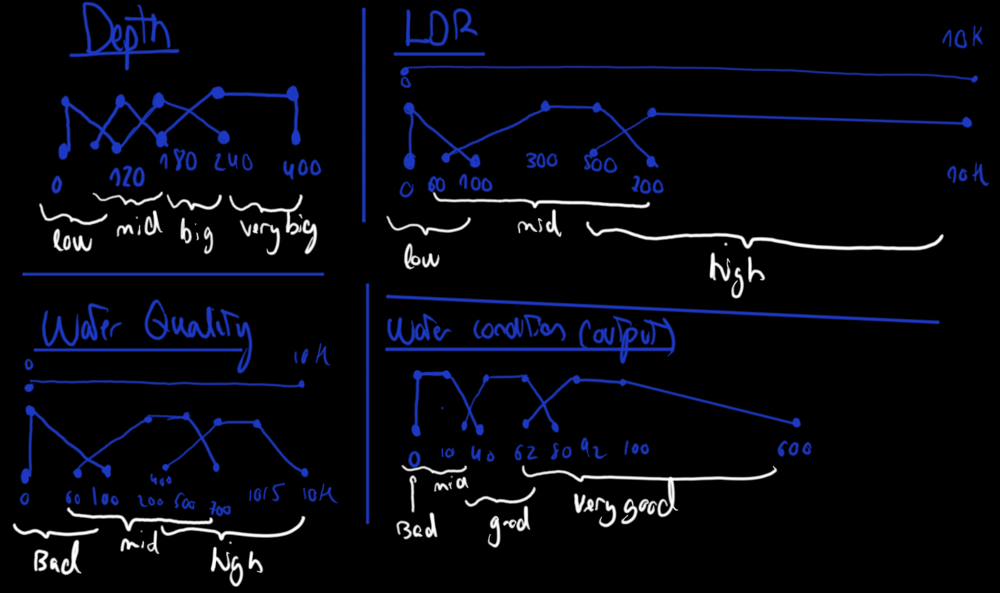
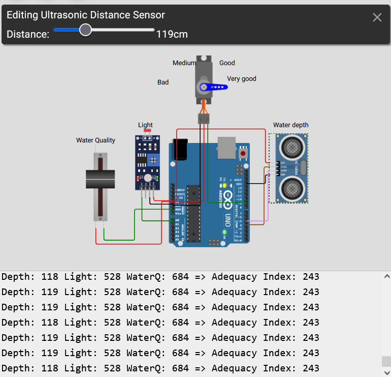

# Fuzzy-Logic-for-ATmega328p
\


[Link al proyecto Wokwi](https://wokwi.com/projects/434204445654407169)
---

\
\
With this activity, we will work with different techniques to improve a system for measuring, controlling, actuating, and presenting climate data in a local HMI through intelligent supervision.

Specifically, we will focus on the implementation of fuzzy logic. By definition, fuzzy logic (also called approximate reasoning) is a multivalued paraconsistent logic in which the truth values of variables can be any real number between 0 and 1. Fuzzy logic allows decisions to be made with varying degrees of intensity depending on intermediate levels of fulfillment of a premise; it adapts better to the real world in which we live, and can even understand and operate with our expressions, such as “it is very hot,” “he is not very tall,” or “the heartbeat is a little fast,” etc.


\


\
In this case, fuzzy logic will be applied to the case of a meteorological buoy. After some research carried out by the team, I found [a paper](https://ambiental.cedex.es/docs/ingenieria-civil-138-2005-fuzzy-logic.pdf) 
that inspired us to apply fuzzy logic to our meteorological buoy for the study of underwater ecosystems. Up to now, the simulation of aquatic habitats had been developed through models based on preference curves of the main hydraulic variables related to habitat quality. Fuzzy logic offers several advantages over classical implementations. With it, a larger number of variables can be introduced. These significantly increase the possibilities of combination among them, allowing us to effectively incorporate expert knowledge and assessment.

After an internal debate, it was concluded that for the hardware we are targeting, the best approach would be to use the combination of the following sensors:

- Distance sensor for water depth.

- Light sensor (luminosity sensor).

- Water quality sensor.


---
\

To carry out the implementation, we will make use of the [EFLL](https://github.com/alvesoaj/eFLL) library available for Wokwi.

The first step is to define the ranges for each of the sensors we are going to use. By knowing the reading values of each one of them, we can determine which regions we are going to establish for the membership function of each sensor, which will have a trapezoidal shape.

Below you can see the first estimation made by the team for each sensor, as well as their regions.



Below is the code used which, through the Fuzzy Logic library, allows us to implement these regions.


```C
  // fuzzy sets
  // Water depth (0-400)
  FuzzySet *lowDepth = new FuzzySet(0, 0, 0, 120); 
  FuzzySet *medDepth = new FuzzySet(60, 120, 120, 180);
  FuzzySet *bigDepth = new FuzzySet(120, 180, 180, 240);
  FuzzySet *verybigDepth = new FuzzySet(180, 240, 400, 400);
  
  // ldr (Potentiometer)
  // Illumination ldr (0-100000 lux after conversion)
  FuzzySet *lowldr = new FuzzySet(0, 0, 0, 100);
  FuzzySet *medldr = new FuzzySet(60, 300, 500, 700);
  FuzzySet *highldr = new FuzzySet(500 ,700, 10000, 10000);

  // Water quality
  FuzzySet *badQ = new FuzzySet(0, 0, 0, 100);
  FuzzySet *medQ = new FuzzySet(60, 200, 500, 700);
  FuzzySet *highQ = new FuzzySet(400 ,700, 1015, 10000);

  // Adequacy of water conditions (index)
  FuzzySet *bad = new FuzzySet(0, 0, 0, 0);
  FuzzySet *medium = new FuzzySet(0, 0, 10, 40);
  FuzzySet *good = new FuzzySet(22, 40, 62, 80);
  FuzzySet *verygood = new FuzzySet(62, 92, 100, 600);
```

Finally, we need to specify the rules that will determine our outputs, making use of Fuzzy Logic itself. These rules are defined below and are inspired by the previously mentioned paper.

```C
  // Rule 1
  // IF depth is medium & ldr is high & waterQ is high THEN adequacy is VERY GOOD
  FuzzyRuleAntecedent *ifDepthMedANDLdrHighANDWaterQHigh1 = new FuzzyRuleAntecedent();
  ifDepthMedANDLdrHighANDWaterQHigh1->joinWithAND(medDepth, highldr);
  FuzzyRuleAntecedent *ifDepthMedANDLdrHighANDWaterQHigh2 = new FuzzyRuleAntecedent();
  ifDepthMedANDLdrHighANDWaterQHigh2->joinWithAND(ifDepthMedANDLdrHighANDWaterQHigh1, highQ);
  FuzzyRuleConsequent *thenAdequacyVeryGood = new FuzzyRuleConsequent();
  thenAdequacyVeryGood->addOutput(verygood);
  FuzzyRule *fuzzyRule1 = new FuzzyRule(1, ifDepthMedANDLdrHighANDWaterQHigh2, thenAdequacyVeryGood);
  fuzzy->addFuzzyRule(fuzzyRule1);

  // Rule 2
  // IF depth is medium & ldr is med & waterQ is high THEN adequacy is GOOD
  FuzzyRuleAntecedent *ifDepthMedANDLdrMedANDWaterQHigh1 = new FuzzyRuleAntecedent();
  ifDepthMedANDLdrMedANDWaterQHigh1->joinWithAND(medDepth, medldr);
  FuzzyRuleAntecedent *ifDepthMedANDLdrMedANDWaterQHigh2 = new FuzzyRuleAntecedent();
  ifDepthMedANDLdrMedANDWaterQHigh2->joinWithAND(ifDepthMedANDLdrMedANDWaterQHigh1, highQ);
  FuzzyRuleConsequent *thenAdequacyGood = new FuzzyRuleConsequent();
  thenAdequacyGood->addOutput(good);
  FuzzyRule *fuzzyRule2 = new FuzzyRule(2, ifDepthMedANDLdrMedANDWaterQHigh2, thenAdequacyGood);
  fuzzy->addFuzzyRule(fuzzyRule2);

  // Rule 3
  // IF waterQ is bad THEN adequacy is BAD
  FuzzyRuleAntecedent *ifWaterQBad= new FuzzyRuleAntecedent();
  ifWaterQBad->joinSingle(badQ);
  FuzzyRuleConsequent *thenAdequacyBad = new FuzzyRuleConsequent();
  thenAdequacyBad->addOutput(bad);
  FuzzyRule *fuzzyRule3 = new FuzzyRule(3, ifWaterQBad, thenAdequacyBad);
  fuzzy->addFuzzyRule(fuzzyRule3);

  // Rule 4
  // IF depth is low THEN adequacy is BAD
  FuzzyRuleAntecedent *ifDepthIsLow= new FuzzyRuleAntecedent();
  ifDepthIsLow->joinSingle(lowDepth);
  FuzzyRule *fuzzyRule4 = new FuzzyRule(4, ifDepthIsLow, thenAdequacyBad);
  fuzzy->addFuzzyRule(fuzzyRule4);

  // Rule 5
  // IF depth is big & ldr is high & waterQ is medium THEN adequacy is GOOD
  FuzzyRuleAntecedent *ifDepthBigANDLdrHighANDWaterQMed1 = new FuzzyRuleAntecedent();
  ifDepthBigANDLdrHighANDWaterQMed1->joinWithAND(bigDepth, highldr);
  FuzzyRuleAntecedent *ifDepthBigANDLdrHighANDWaterQMed2 = new FuzzyRuleAntecedent();
  ifDepthBigANDLdrHighANDWaterQMed2->joinWithAND(ifDepthBigANDLdrHighANDWaterQMed1, medQ);
  FuzzyRule *fuzzyRule5 = new FuzzyRule(5, ifDepthMedANDLdrMedANDWaterQHigh2, thenAdequacyGood);
  fuzzy->addFuzzyRule(fuzzyRule5);

```

Below is an example of the system in operation using Fuzzy Logic, with parameters set to be favorable for marine ecosystems.


